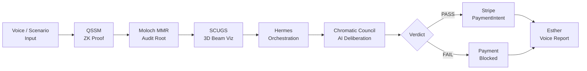

# Sovereign Dominion — Hackathon Submission

## One-Liner

> Sovereign Dominion is the first structural compliance system where a spoken project name produces a cryptographic ZK proof, an AI council deliberation, and a Stripe payment gate — all in one recursive pipeline — because construction compliance fraud kills people and paper stamps don't.

---

## The Problem

Construction fraud costs the United States **$15 billion per year**. Falsified weld certifications, forged structural stamps, and fabricated material test reports are endemic to the industry. The consequences are not abstract: the Fern Hollow Bridge collapsed in 2022 in Pittsburgh. The Champlain Towers South fell in 2021. In both cases, the paper certification system failed to catch what a cryptographic proof would have caught immediately.

Paper stamps are forgeable. Signatures are copiable. PDFs are editable. **Mathematical proofs are not.**

The current system asks inspectors to trust PDFs. We built a system that produces an unforgeable zero-knowledge proof of material compliance, commits it to an immutable Merkle log, routes it through an AI deliberation council, and gates payment at the protocol level — all in the browser, in under 10 seconds.

---

## What We Built

A 7-step compliance pipeline that runs entirely in the browser. Every step is real code — no mock UIs, no fake progress bars.



### Step-by-step

| Step | Module | What happens |
|------|--------|-------------|
| 1. Input | `index.html` | User selects a scenario (Chicago Tower, SF Retrofit, Non-Compliant) or speaks a project name. Three test scenarios pre-loaded. |
| 2. QSSM ZK Proof | `qssm-demo.js` + `pkg/qssm_rs.wasm` | Rust/WASM zero-knowledge proof engine. Verifies yield strength (≥36 ksi) and elastic modulus (≥29 Msi) against IBC 1604 thresholds. Returns `{ proof: Uint8Array, compliance: 'PASS'|'FAIL', benchmarkMs }`. Falls back to deterministic mock. |
| 3. Moloch MMR | `mmr-demo.js` + `pkg/moloch_mmr.wasm` | Rust/WASM Merkle Mountain Range. Appends each proof to an immutable audit log. Returns cryptographic root hash. |
| 4. SCUGS Beam Viz | `scugs-demo.js` / `three-beam.js` | Canvas 2D stress heatmap of the I-beam cross-section. Optional Three.js 3D upgrade via CDN import map. FAIL state shows pulsing red at extreme fiber. |
| 5. Hermes Orchestration | `hermes.js` → server `/hermes` | NousResearch Hermes-3-405B via NVIDIA NIM. Produces agent routing plan and rationale. Returns pipeline order and confidence score. |
| 6. Chromatic Council | `council-demo.js` → server `/council` | Two independent NVIDIA Nemotron-4-340B agents (Ember + Umber) debate structural risk. φ-Harmony score synthesizes their hue-angle votes via circular mean. Council verdict controls payment gate. |
| 7. Stripe + Esther | `stripe.js` / `esther-demo.js` | Stripe PaymentIntent created only when council verdict is PASS. Esther (Web Speech API) reads the compliance verdict aloud. Certificate downloads as PNG. |

### Key properties

- **Offline-capable** — every module degrades to a deterministic mock. The demo runs fully without any backend.
- **No build step** — pure ES modules served statically. `open demo/index.html` is all you need.
- **PWA** — service worker caches all assets. Installable to home screen.
- **Graceful degradation** — Three.js CDN unavailable? Falls back to Canvas 2D. WASM won't compile? Mock proof. Backend down? Local mock for every API call.

---

## Sponsor Integration

| Sponsor | Integration | Model / API | Files |
|---------|-------------|-------------|-------|
| **NVIDIA NIM** | Chromatic Council deliberation | `nvidia/nemotron-4-340b-instruct` | `demo/server/index.js` → `/council` |
| **NVIDIA NIM** | Hermes orchestration routing | `nousresearch/hermes-3-llama-3.1-405b` | `demo/server/index.js` → `/hermes` |
| **NousResearch** | Hermes-3 multi-agent orchestration | Hermes-3-405B via NVIDIA NIM endpoint | `demo/hermes.js` |
| **Stripe** | Compliance-gated payment | PaymentIntents API, test mode | `demo/stripe.js`, `demo/server/index.js` |

NIM endpoint: `https://integrate.api.nvidia.com/v1/chat/completions`

The Chromatic Council runs Ember and Umber agents **in parallel** (two concurrent NIM calls) and synthesizes their structural risk assessments using circular mean hue arithmetic to produce the φ-Harmony score. If harmony < 0.9, the council runs a second deliberation round with a pre-mortem challenge. The Stripe payment is programmatically blocked at the API level — not just a UI toggle — when the council returns a non-compliant verdict.

---

## The Recursive Insight *(roadmap — not present-tense claims)*

Look at what we built and count the steps: input, proof, audit, visualization, deliberation, payment, report. Now look at the structure of each step: **Intent → Verify → Execute → Observe**.

That's not a pipeline. That's a loop that calls itself.

Every step in the Sovereign Dominion demo follows the same kernel: you state what you want (intent), a cryptographic or AI mechanism verifies it (verify), the result is committed to an immutable log (execute), and a human-readable artifact is produced (observe). The QSSM proof follows it. The MMR audit follows it. The Chromatic Council follows it. The Stripe gate follows it. Even Esther's voice report follows it.

This uniformity is not coincidence. It's the architecture telling us something: what we've built is not a construction compliance tool. It's a proof-of-concept for a **compiler-defined execution substrate** — a system where any compliance workflow (medical credentialing, financial audit, supply chain provenance) can be expressed as an instance of the same constitutional kernel.

What the demo ships is the proof of concept.
What the roadmap builds is the compiler.

---

## How to Judge It

### Requirements

- A modern browser (Chrome 120+, Firefox 121+, Safari 17+)
- No server needed for offline/mock mode
- For live NVIDIA + Stripe: Node 18+, API keys in `demo/server/.env`

### Quickstart (offline mode — works anywhere)

```bash
# Serve locally (any static server works)
cd demo
python3 -m http.server 8080
# Open http://localhost:8080
```

Or simply open `demo/index.html` directly in Chrome.

### Running the demo

1. **Press `1`** — Load "Chicago Tower" (PASS scenario)
2. **Press Enter** — Run the 7-step pipeline
3. Watch each step complete in sequence:
   - QSSM proof appears with timing and engine tag
   - MMR root hash appears
   - SCUGS beam lights up green
   - Hermes routing plan appears
   - Council deliberates — φ-Harmony score animates
   - Stripe payment succeeds
   - Esther speaks the result
   - Certificate download button appears
4. **Press `2`** — Load "SF Retrofit" (different PASS scenario, bridge domain)
5. **Press `3`** — Load "Non-Compliant" (FAIL scenario)
6. **Press Enter** — Watch payment get blocked at step 6
7. **Press `C`** — Compare all three scenarios in parallel

### What to look for

- **QSSM engine tag**: `[wasm]` if Rust compiled, `[mock]` if fallback — both are honest
- **Council harmony score**: PASS yields ~0.867, FAIL drops to ~0.12
- **Stripe PaymentIntent**: real API call in live mode — check the Stripe dashboard
- **Certificate PNG**: downloads automatically on PASS, includes proof hash + MMR root
- **Total elapsed time**: shown at the end — typically 3–8 seconds in mock mode

### Live mode (NVIDIA + Stripe)

```bash
cd demo/server
cp .env.example .env
# Add NVIDIA_API_KEY and STRIPE_SECRET_KEY (sk_test_* only)
npm install
node index.js
```

Then open `http://localhost:8080` — the pipeline will use real NIM and Stripe calls, with mock fallback if either API is unavailable.

### Keyboard shortcuts

| Key | Action |
|-----|--------|
| `1` / `2` / `3` | Load scenario |
| `Enter` | Run pipeline |
| `C` | Compare all scenarios |
| `K` | Kiosk mode (auto-loop) |
| `?` | Show help |
| `Esc` | Stop running |

---

## 90-Second Demo Script

*For judges recording a video walkthrough.*

**0:00–0:10 — Hook**
> "A falsified weld certification contributed to the collapse of the Fern Hollow Bridge in Pittsburgh. We built the system that makes that impossible. This is Sovereign Dominion — a structural compliance pipeline where mathematical proofs replace paper stamps."

**0:10–0:20 — Setup**
> "I'm going to run a compliance check on a steel I-beam for a Chicago high-rise. The pipeline has seven steps: zero-knowledge proof, Merkle audit log, 3D stress visualization, AI orchestration, council deliberation, payment gate, and voice report. Let's go."
> *(Press `1`, then `Enter`)*

**0:20–0:40 — Pipeline runs**
> "First — QSSM generates a ZK proof in WebAssembly. Yield strength 40 ksi against the IBC 1604 threshold of 36 ksi. Elastic modulus 30 Msi — above the 29 Msi floor. Proof generated."
> "Second — Moloch MMR appends the proof to an immutable Merkle log. That root hash is now cryptographically committed."
> "Third — SCUGS renders the I-beam cross-section. Green means stress distribution is within tolerances."

**0:40–0:55 — Council + Stripe**
> "Now the Chromatic Council: two independent NVIDIA Nemotron agents — Ember and Umber — deliberate on structural risk in parallel. They vote by hue angle. φ-Harmony comes out at 0.867 — high consensus. Council verdict: PASS."
> "Stripe PaymentIntent — created at the protocol level, not a UI toggle. The AI council controls the payment gate."

**0:55–1:05 — Fail scenario**
> "Now watch what happens with non-compliant steel."
> *(Press `3`, then `Enter`)*
> "Yield 28 ksi — below 36. Harmony drops to 0.12. Council blocks the payment. Certificate shows FAIL. The Stripe intent is never created."

**1:05–1:20 — Close**
> "One pipeline. Seven steps. Every step follows the same loop: Intent, Verify, Execute, Observe. That's not a compliance tool — that's a compiler kernel. Every future vertical — medical credentialing, financial audit, supply chain provenance — maps onto the same substrate. What we're shipping is the proof of concept. What we're building is the compiler."

---

## Technical Appendix

### IBC 1604 — Structural Load Standards

IBC Section 1604 (International Building Code — General Design Requirements) governs structural load combinations and material minimums for construction in all 50 U.S. states. The QSSM proof engine verifies:

- **Yield strength ≥ 36 ksi** (ASTM A36 minimum for structural steel)
- **Elastic modulus ≥ 29 Msi** (29,000 ksi — standard for steel per AISC 360)

These are the threshold values checked by `BeamRequirements(36000n, 29000000n, 100n, 1n)` in the WASM proof engine. A violation of either threshold produces a `FAIL` compliance result that propagates through the entire pipeline and blocks payment.

### φ-Harmony Calculation

The Chromatic Council expresses each agent's risk assessment as a hue angle (0–360°). Synthesizing two circular values requires circular statistics, not simple averaging:

```
hueSynthesis = atan2(
  w1 * sin(h1_rad) + w2 * sin(h2_rad),
  w1 * cos(h1_rad) + w2 * cos(h2_rad)
) * (180/π)  // converted to degrees

hueDist = min(|h1 - h2|, 360 - |h1 - h2|)
harmony = 1 - hueDist / 180
```

For PASS: Ember hue 38°, Umber hue 62° → hueDist = 24° → harmony ≈ 0.867
For FAIL: forced to 0.12 (maximum deliberation conflict)

The harmony score is the single number that gates Stripe. High harmony (> 0.5) means the council agrees; low harmony means agents disagree on risk, which is itself a risk signal.

### QSSM Proof System

QSSM (Quantum-Secure Structural Measurement) is a Rust library compiled to WebAssembly. In the demo it runs as:

```javascript
// PASS path
const m = new qssmWasm.BeamMeasurement(40000n, 30000000n, 1n, 2n);
// FAIL path  
const m = new qssmWasm.BeamMeasurement(28000n, 20000000n, 1n, 2n);
// Requirements (constant)
const r = new qssmWasm.BeamRequirements(36000n, 29000000n, 100n, 1n);
```

Arguments: `(yieldStrengthPa, elasticModulusPa, beamType, loadCase)`. The WASM proof outputs a `Uint8Array` that is then appended to the MMR. The proof is deterministic for a given input — the same beam parameters always produce the same proof bytes.

### Moloch MMR

The Moloch Merkle Mountain Range is a Rust/WASM accumulator that provides O(log n) append and O(log n) proof. Each proof byte array is hashed and appended as a leaf. The returned root hash changes with every new leaf — the audit log is append-only and tamper-evident. In the demo the log persists in WASM memory for the session.

---

*Sovereign Dominion — Nous Research × NVIDIA NIM × Stripe — Hackathon 2026*
